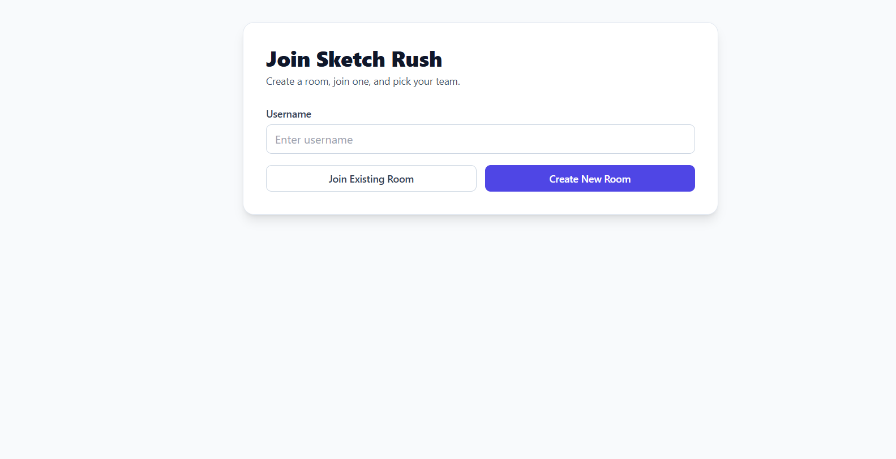
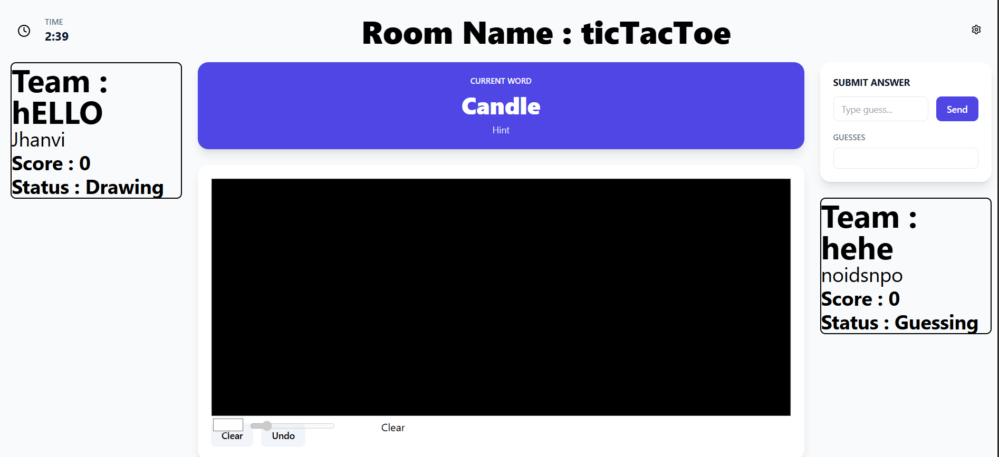

# SketchRush

Real-time multiplayer drawing and guessing game built with a React + Vite client and an Express + Socket.IO server.

## Home

The home screen is a lightweight lobby where players enter a username, create a room, or join an existing room before moving into team selection and game play.



## Features

Core experience: A fast, social drawing game where players gather in a room, split into teams, and play through shared rounds. The flow keeps the lobby simple so users can get into the game quickly.

Room creation & joining: Players can create a new room or join an existing one with a room code. Success and error states are shown inline so the lobby stays easy to understand.

Team lobby: Once connected, players can create or join groups inside the room and see the current team roster update in real time.

Canvas gameplay: The shared canvas lets the active player draw while everyone else watches and guesses. Draw start, line, end, and clear events are synchronized through Socket.IO.



Guessing panel: Players submit guesses from the game room, and the UI listens for server feedback so rounds stay interactive.

Round control: A start-game overlay appears until the room is ready, then the round begins with room settings and game state managed through shared context.

Room settings: The room can expose configurable game options such as timer length and word pool, giving hosts a simple way to tune gameplay.

Realtime updates: Room membership, group changes, and canvas actions are pushed live through the socket layer so every connected player sees the same state.

Polished UI/UX: The app uses clean cards, subtle shadows, responsive layout, and a focused game-room arrangement so the canvas and team panels stay readable.

Performance & DX: Vite provides fast local development, and the client is organized around reusable components, contexts, and socket service helpers.

## Tech Stack

Client: React, Vite, React Router, Socket.IO client, Tailwind CSS

Server: Node.js, Express, Socket.IO, CORS, dotenv

## Repository Layout

```text
SketchRush/
  client/           # React app (components, pages, context, services)
  server/           # Express API + Socket.IO server (controllers, services)
  README.md
```

## Prerequisites

Node.js 18+

npm installed and available in your shell

## Environment

### Client (`client/.env`)

Create `client/.env` with:

```env
VITE_URL=http://localhost:3000
```

### Server (`server/.env`)

Create `server/.env` with:

```env
PORT=3000
CLIENT_ORIGIN=http://localhost:5173
```

Notes:

- `VITE_URL` should point to the running Socket.IO backend.
- `CLIENT_ORIGIN` can be a comma-separated list of allowed frontend origins.

## Install & Run

Open two terminals from the project root.

### Server

```powershell
cd server
npm install
npm run dev
```

### Client

```powershell
cd client
npm install
npm run dev
```

## Local URLs

Client: http://localhost:5173

API / Socket server: http://localhost:3000
